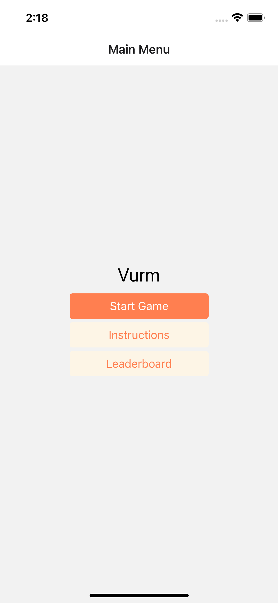
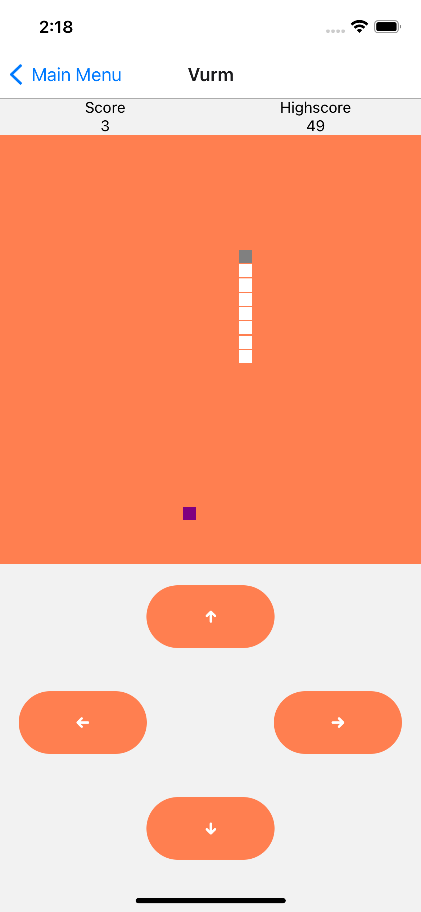
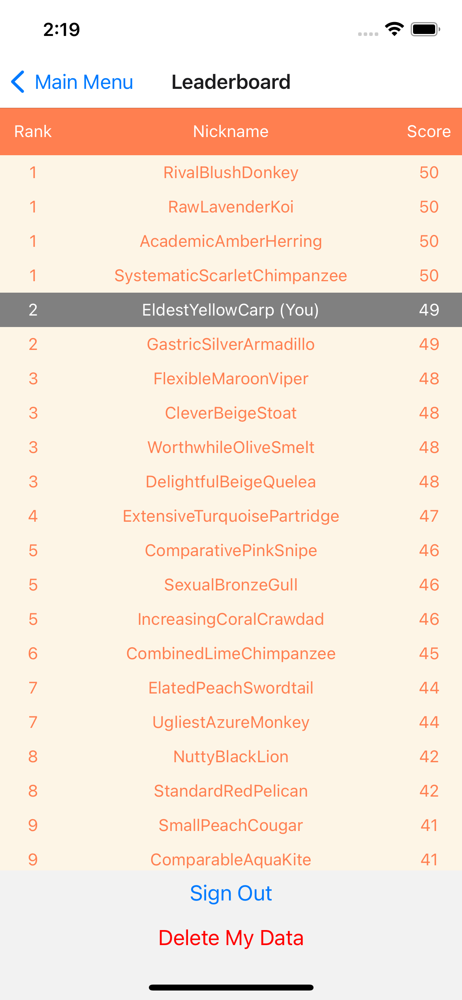
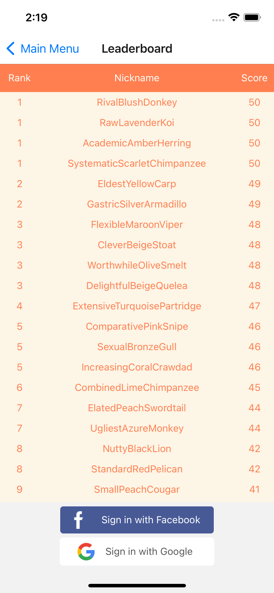

# Vurm

Vurm is a WIP mobile frontend training project, which implements [Snake](<https://en.wikipedia.org/wiki/Snake_(video_game_genre)>) in React Native with a simple leaderboard system enabled by [Google's Firebase Realtime Database](https://firebase.google.com/docs/database) and [OpenID Connect](https://docs.expo.dev/versions/latest/sdk/auth-session/) for both authentication and authorization.

<p align="center" float="left">





<p/>

## Motivation

The project was started as a way for the contributor(s) to gain experience with cross-platform mobile frontend development, using [React Native](https://reactnative.dev/) and JavaScript for development, and [react-native-testing-library](https://callstack.github.io/react-native-testing-library/docs/getting-started/) and [Jest](https://jestjs.io/) for testing. The project is managed with the [Expo CLI](https://jestjs.io/), in contrast to the [React Native CLI](https://reactnative.dev/docs/environment-setup#development-os). However, the project can easily be [ejected](https://docs.expo.dev/expokit/eject/), and the project has progressed far enough that the application is no longer restricted to simulation through the Expo Go application as a [managed application](https://docs.expo.dev/introduction/managed-vs-bare/), but is built with the [expo run](https://blog.expo.dev/introducing-expo-run-commands-835ae8da4813)-command, to run as a standalone application during development. As an example, simulating through the Expo Go application breaks the ability use the OpenID Connect feature, as Expo Go will be the application which makes the corresponding calls to the OAuth 2.0 APIs of the social login providers.

## Installation

These installation guidelines has as scope to get Expo CLI up and running on your box, and to run a simulator build on an iOS simulator. **You will need a Mac to run the Xcode simulator**. These steps have been tested to work on an M1 Mac:

- Install [Node.js 16.50.0 LTS](https://nodejs.org/en/)
- Install [Yarn](https://classic.yarnpkg.com/en/docs/install#mac-stable) (probably optional)
- Install [Expo CLI](https://docs.expo.dev/get-started/installation/#installing-expo-cli)
- Install [Xcode](https://developer.apple.com/xcode/)

If you have an M1 Mac and failing to build the project, consider [running Xcode under Rosetta](https://www.macworld.com/article/338843/how-to-force-a-native-m1-mac-app-to-run-as-an-intel-app-instead.html). Custom code has been added to the project in an attempt to circumvent this necessity.

## Running

To run the project in a simulator, `cd` into the project's root folder and run

```shell
$ yarn install && expo run:ios
```

If you instead decide to use `npm` you will need to replace the `yarn`-command above with its corresponding counterpart.

## Known issues

This is a non-exhaustive list of issues in the project, be it code performance, code smell or project structure:

- Facebook login will not work unless your Facebook account is added to the list of approved test users (Facebook application is still in development mode)
- Some performance issues during the first few seconds of rendering the game. This smoothens out as the game progresses past its first few ticks.
- The Game-component (`./src/components/Game.js`) is still a class component, and should be rewritten to a functional component.
- All components (except the modal loading screen) have a few unit tests, as well as the Snake-class (`./src/classes/Snake.js`). The component tests mostly just compare their render to a snapshot, but some test some other things as well. **The unit tests of this projects should be heavily expanded to cover all units used in `./src`**.
- All colors have been moved into its own file (`src/colors.js`), from which all components can import them. However, there are perhaps better alternatives to manage global themes (see e.g. [React Navigation's Themes](https://reactnavigation.org/docs/themes/))
- There are currently no sounds. A game should have sounds, right?

## Feedback

This project is still in its infancy, and has at least one contributor who is still familiarizing themselves to frontend and mobile development. As such, the project is more or less bound to have issues with e.g. bad code hygiene. Any feedback is **very** welcome, so please do not hesitate to get in touch if you would like to contribute to the project with either guidance or pull-request. For contact information, see [Contact](#contact).

## Android?

The application has thus far only been tested to be working on an iOS simulator, and will have known restrictions on Android (as e.g. authentication through Google's OAuth 2.0 API) due to features which have not yet been added to the project. As you might notice, there is no `./android`-directory in this repo as of yet. If you would like to attempt to build for Android, a good place to start would be to run

`$ expo run:android`

and Expo will set up the bare necessities for you.

## Contact

If you have any questions, issues with getting the project up and running on your box, feedback or anything else on your mind related to this project, do not hesitate to contact Christoffer at

- christoffer(dot)sorensen(at)accenture(dot)com
